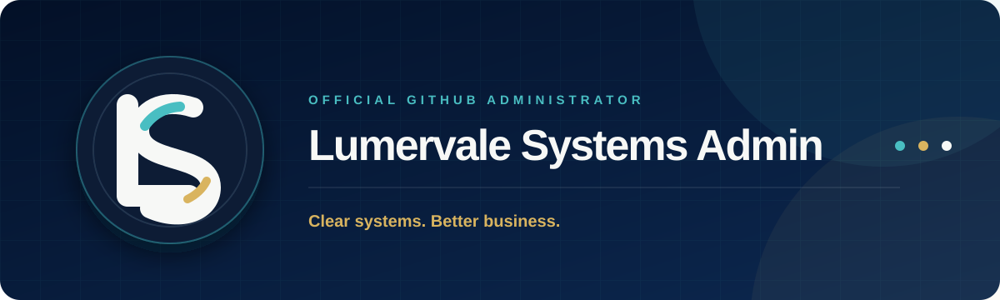

  

  

<h1 align="center">Lumervale Systems Admin</h1>

  <strong>Official administrator and technical steward for Lumervale Systems.</strong>

  We maintain the public repositories, website, documentation and digital systems that represent
  <a href="https://github.com/lumervalesystems"><strong>Lumervale Systems</strong></a> on GitHub.

  <a href="https://lumervalesystems.github.io/"><strong>Website</strong></a>
  &nbsp;•&nbsp;
  <a href="https://github.com/lumervalesystems"><strong>Organization</strong></a>
  &nbsp;•&nbsp;
  <a href="https://github.com/lumervalesystems/lumervalesystems.github.io"><strong>Official website repository</strong></a>

---

## About this account

This is the official GitHub administration account for **Lumervale Systems**, an independent digital systems studio that helps modern service businesses replace scattered tools, repetitive work and unclear customer journeys with focused websites, organized workflows and practical automation.

The account exists to keep the organization's technical work consistent, documented, maintainable and responsibly presented. It is used for repository administration, website maintenance, public documentation, quality review and the responsible coordination of new digital initiatives.

> **Clear systems. Better business.**

## Our mission

Our mission is to make everyday digital work easier to understand and easier to manage. We connect strategy, design and implementation so that each solution supports a real operational need instead of adding unnecessary complexity.

We focus on systems that are:

- **Clear** — people can understand what to do and where to go
- **Useful** — every component supports a practical business objective
- **Responsible** — privacy, accessibility and human oversight are considered from the beginning
- **Maintainable** — documentation and sensible structure make future improvement possible
- **Ready to evolve** — foundations can grow without forcing a complete restart

## What Lumervale Systems helps build

| Web experiences | Workflow automation |
| --- | --- |
| Focused, responsive websites organized around the audience, message and next business action. | Connected processes that reduce repetitive tasks, improve consistency and make work easier to follow. |

| Client experience systems | Digital operations |
| --- | --- |
| Structured intake, appointments, communications, follow-up and service handoffs. | Practical internal tools, organized information and process documentation for everyday teams. |

| Responsible AI assistance | Technical foundations |
| --- | --- |
| Carefully scoped AI-assisted workflows with human review for important decisions and communications. | Reusable components, accessible interfaces and maintainable project structures built for long-term use. |

## How we work

| Stage | Purpose | Outcome |
| --- | --- | --- |
| **01 — Discover** | Understand the business, audience and real operational need. | A clear definition of the problem and desired result. |
| **02 — Map** | Document the current journey, tools, decisions and handoffs. | Visibility into friction, duplication and missing connections. |
| **03 — Simplify** | Remove unnecessary steps and choose the right-sized approach. | A focused plan without avoidable complexity. |
| **04 — Build** | Design and implement the agreed website, workflow or system. | A usable solution aligned with the real work. |
| **05 — Verify** | Review behavior, accessibility, content, privacy and reliability. | A tested result with clear documentation. |
| **06 — Improve** | Learn from use and refine what creates genuine value. | A maintainable system that can evolve over time. |

## Current responsibilities

- Maintain the official Lumervale Systems website and public GitHub presence
- Organize repositories, assets and technical documentation
- Review public content for clarity, accuracy and brand consistency
- Support accessible, responsive and dependable web experiences
- Establish reusable patterns without creating unnecessary dependencies
- Protect credentials, internal information and client privacy
- Document important implementation and maintenance decisions
- Review automated and AI-assisted work before it affects people or business operations

## Engineering and documentation standards

Public projects maintained through this account aim to follow these standards:

| Standard | Commitment |
| --- | --- |
| **Clarity** | Repository purpose, setup and important decisions should be understandable. |
| **Accessibility** | Interfaces should support readable content, keyboard use and responsive layouts. |
| **Maintainability** | Files and responsibilities should be organized consistently and documented. |
| **Security** | Credentials, private records and sensitive configuration must never be committed publicly. |
| **Reliability** | Important changes should be reviewed and verified before publication. |
| **Privacy** | Only information appropriate for a public repository should be included. |
| **Human oversight** | Automation supports people; it does not silently replace judgment in important decisions. |

## Responsible technology principles

Lumervale Systems does not use its public presence to create misleading impressions. Our documentation and portfolio materials should remain factual, restrained and verifiable.

- No invented clients, testimonials, partnerships or certifications
- No fabricated performance metrics or guaranteed business outcomes
- No private client records, personal data, passwords or access tokens
- No hidden automation intended to deceive users
- No important AI-assisted decision without appropriate human review
- No unnecessary collection of personal information
- Clear explanations when a process or limitation matters to the user

## Organization ecosystem

| Resource | Purpose | Link |
| --- | --- | --- |
| **Lumervale Systems** | Official GitHub organization and public project home. | [Visit organization](https://github.com/lumervalesystems) |
| **Official website** | Public introduction to services, process and working principles. | [Visit website](https://lumervalesystems.github.io/) |
| **Website repository** | Source, assets and documentation for the official website. | [View repository](https://github.com/lumervalesystems/lumervalesystems.github.io) |

## Collaboration approach

We begin with the real need, identify the smallest useful system and create a clear path from idea to implementation. A strong collaboration should leave the business with more clarity, not more dependency.

When reviewing a potential project, we look for:

1. The business outcome the work should support
2. The people who will use or maintain the result
3. The repetitive work or confusion that should be reduced
4. The information and integrations genuinely required
5. The privacy, accessibility and maintenance responsibilities involved
6. A realistic method to verify whether the solution is useful

## Contact and official links

For current information about Lumervale Systems, its services and public work, use the official links below:

  <a href="https://lumervalesystems.github.io/"><strong>Explore the website</strong></a>
  &nbsp;•&nbsp;
  <a href="https://github.com/lumervalesystems"><strong>View the organization</strong></a>
  &nbsp;•&nbsp;
  <a href="https://github.com/lumervalesystems?tab=repositories"><strong>Browse public repositories</strong></a>

---

  

  <strong>Lumervale Systems</strong> 
  Clear systems. Better business. 
  Designed for clarity · Built with responsibility · Ready to evolve

